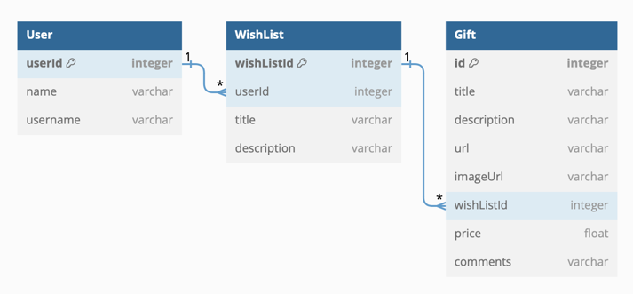

# ! AI doesn't work if no network connection

# Sources
- https://spring.io/guides/tutorials/rest/
- https://www.youtube.com/watch?v=xHminZ9Dxm4

# Database model

# ???
- **Sort** GiftResponseDTOs, not gifts
  - Or even just id and priority
  - Gifts are sorted before they are listed for a WishList
- Should have a smaller Gift class
  - Like, **GiftIdea**, without price or url or image
  - Contains description, optionally image
  - Then Gift should Extend this class with url
  - If gift idea - provide description
    - if URL - do no, use comments?? 
  - How to solve this in the database?
- **Comments as an additional table**
  - Kind of a conversation under a post
  - Each comment has text, is connected to a Gift and to a user giving the comment
  - And have an ID. 
- Change of priority
  - How? Just setPriority() to whatever?
  - Unique? Don't think so?

# TO DO:
- Web crawl the URL, get content, use AI to produce description
- Then use description to produce title
- WishList - total price
- Gift - status - who - what
  - User chooses a gift - bought - but the owner doesn't see that, others can see
  - GiftStatus? Id, status (none, ordered, arrived, bought), userid
- Logging

# STATUS:
- Is the gift bought, or not
- Who should see that information
- WishList share - who can see what
  - private, public, who to share with